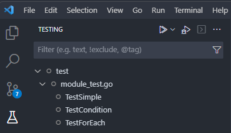

# terraform-module-testing

This instructional repo contains exercises for testing Terraform modules.
It makes use of [Azure/terratest-terraform-fluent](https://github.com/Azure/terratest-terraform-fluent) to provide a fluent interface and more human readable code.

## Quick start

Create a copy of this template repository and clone it to your local machine.
Start with the [`level_01`](./level_01) directory.

## Go Skills

It is recommended to take the Basics section of [Go Tour](https://go.dev/tour).

## Software pre-requisites

- [install go](https://go.dev/doc/install)
- [install terraform](https://developer.hashicorp.com/terraform/tutorials/aws-get-started/install-cli)

## IDE

It is recommended to use an IDE with Go language support.
VSCode is a great IDE and the recommended extensions have been included in this repository.

### GitHub Copilot

GitHub Copilot is a new feature that uses machine learning to help you write code.
It is available in VSCode and is a great way to learn Go.
Add comments to your code to help Copilot understand what you are trying to do.

## Running the tests

If you choose to use VSCode then the testing can be run from the IDE as shown in this image:



Tests can always be run from the command line, but debugging is more difficult:

```bash
cd level_01/test
go test -v -timeout 10m -run ^TestSimple
```
